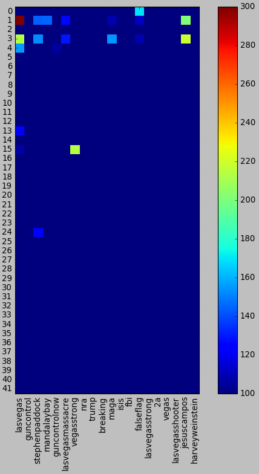

# Community Analysis
### #lasvegasshooting

The next step in our analysis is to define communities in our networks and see what these communities revolve around.

## Mention Graph Communities

First, we will look into the sizes of the communities in the mention graph and the biggest accounts in  communities, to get a sense for the type of accounts we find. Also here we will see  which are the websites cited in communities and what percentage of users have cited these pages.

Then, we will look into the most common hashtags used in every community in the mention graph, to get a feeling for the topics that live in every community.

We use the [Louvain method \[1\]](references) for community detection with
the following [implementation](https://github.com/taynaud/python-louvain) in
Python.

## Plots

Below two plots are displayed of the communities found with the Louvain
algorithm, with a legend table that shows some information on the most connected
nodes in this community, under the assumption that this will tell us something
about the community as a whole.



Here the percentages are percentage of the users who cited the website at least ones.  So the for the community 40, (second line), 75.0% of the users cited theantimedia.org, 50% cited youtube.com.

## Analysis
When we think both table above we see some interesting results:

+ Especially when people are spreading rumors, they tend to share videos. For example, for this event people generally claim that there was multiple shooter and they share videos related to this claim. We can see this in lines 1 and 3 (community no 40 and 6). Most of the users who shared news from alternative media are sharing videos from youtube.

+ There might be a relationship between 'www.intellihub.com', 'yournewswire.com'. (Actually we saw that both are alternative media)

  + In the line forteen we can see that there is a relation between sites, www.reviewjournal.com and lvrj.com. This is actually true since both of them are local media of Las Vegas.

An interesting way to analyze communities is to find which hashtags they tend to use. For example if a community tends to use '#guncontrol'  hashtag we can infer that there is a relation with this community and the gun laws.

  

The *heatmap* above displays how often the most common hashtags appear in every community. The brighter the color, the more prevalent that hashtag is in the tweets from that community and by extension from the users. This gives us an idea about the ideas or opinions of these users. The data is a little sparse for most communities since they are small and there are not that many hashtags, but we can see some interesting patterns emerge in the ones that do have data.

+ The most interesting fact we see is that there is a strong correlation betweent the community 1 and the community 3. Actually those communities are the alternative media communities (AntiMedia and IntelliHub communities)

+ Only communities 0,1,3 are using falseflag. This shows that alternative media tend to spread the news that the event was fake.

## Information Graph Communities

| Partition | Partition Size | Node with biggest degree | Degree |          FirstFiveBiggestSites           |
| :-------: | :------------: | :----------------------: | :----: | :--------------------------------------: |
|     0     |      146       |  www.reviewjournal.com   |  318   | [(www.reviewjournal.com, 318), (vimeo.com, 120), (news3lv.com, 108), (m.youtube.com, 95)] |
|     1     |      238       |     www.youtube.com      |  791   | [(www.youtube.com, 791), (soundcloud.com, 52), (www.veteranstoday.com, 24), (www.wnyc.org, 24)] |
|     2     |      360       |     www.nytimes.com      |  351   | [(www.nytimes.com, 351), (www.washingtonpost.com, 300), (www.cnn.com, 218), (www.newsweek.com, 211)] |
|     3     |      108       |     www.facebook.com     |  299   | [(www.facebook.com, 299), (www.msn.com, 22), (squawker.org, 15), (www.worldstarhiphop.com, 11)] |
|     4     |      110       |      abcnews.go.com      |  303   | [(abcnews.go.com, 303), (www.latimes.com, 297), (vid.me, 51), (nordic.businessinsider.com, 47)] |
|     5     |      102       |   www.dailymail.co.uk    |  332   | [(www.dailymail.co.uk, 332), (www.naturalnews.com, 150), (www.reddit.com, 72), (thenewyorknewsday.com, 69)] |
|     6     |      182       |    www.intellihub.com    |  257   | [(www.intellihub.com, 257), (yournewswire.com, 233), (www.cbsnews.com, 226), (truepundit.com, 215)] |
|     7     |      168       | www.thegatewaypundit.com |  252   | [(www.thegatewaypundit.com, 252), (www.zerohedge.com, 238), (nypost.com, 233), (www.gofundme.com, 212)] |
|     8     |       94       |     www.foxnews.com      |  348   | [(www.foxnews.com, 348), (imgur.com, 28), (www.ibtimes.co.uk, 26), (chicago.suntimes.com, 22)] |
|     9     |       46       | www.businessinsider.com  |   82   | [(www.businessinsider.com, 82), (insider.foxnews.com, 65), (www.americanthinker.com, 52), (www.circa.com, 51)] |
|    10     |       8        |     www.redcross.org     |   5    | [(www.redcross.org, 5), (www.redcrossblood.org, 4), (insidefirstaid.com, 3), (cpr.heart.org, 3)] |
|    11     |       28       |      www.google.com      |   84   | [(www.google.com, 84), (www.ctvnews.ca, 17), (pbs.twimg.com, 14), (wjhl.com, 8)] |
|    12     |       3        |        abc27.com         |   3    | [(abc27.com, 3), (s.pennlive.com, 2), (www.pahouse.com, 2)] |
|    13     |       9        |        elpais.com        |   16   | [(elpais.com, 16), (www.letraslibres.com, 4), (www.sexenio.com.mx, 4), (canaln.pe, 4)] |

This table clearly gives incredible insight about which website is similar to which. Similar sites are generally grouped with other similars.

- We can directly see that in community 13, there are Spanish websites.
- In community 10, there are websites about first aid.
- Community 6 and 7 are alternative media.
- Community 2 is mainstream media
- Community 1 is general visual media (vimeo, youtube)

Finally we can safely say that thanks to the analysis we performed here, we can categorize media. Thanks to this analysis it is possible to detect alternative media which is used to spread fake news.
