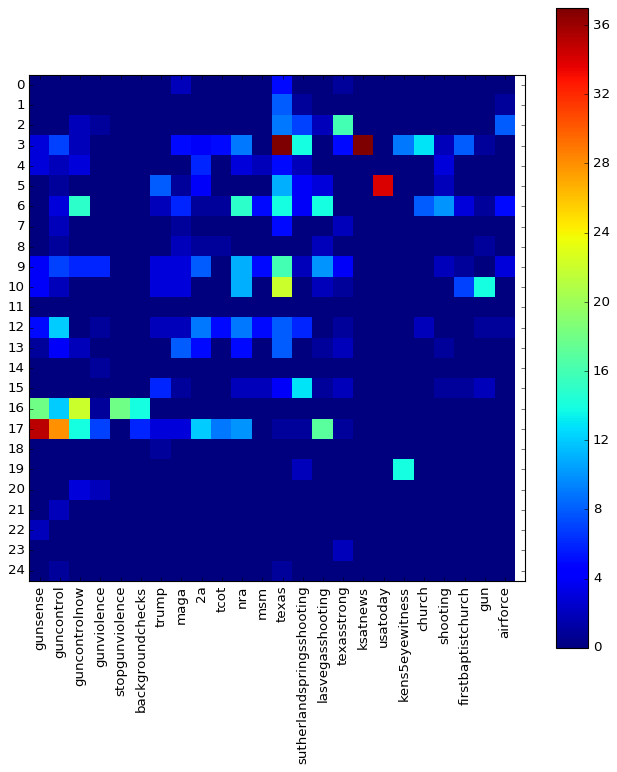
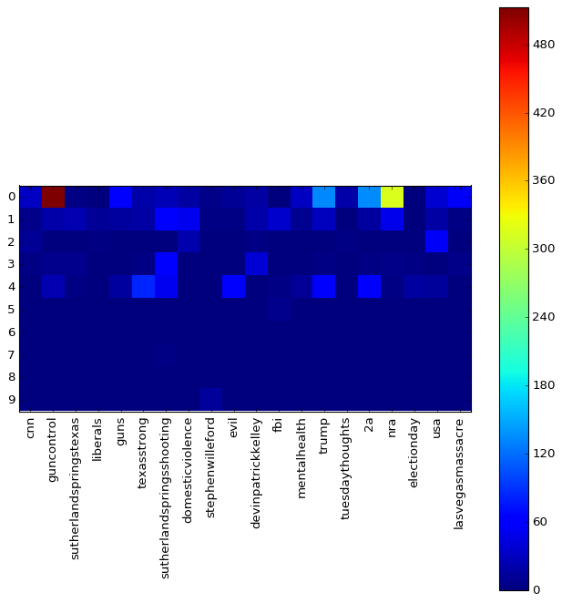

# Community Analysis

The next step in our analysis is to define communities in our network and
see what these communities revolve around.First, we will look into the
sizes of the communities and the biggest accounts in the biggest communities,
to get a sense for the kind of accounts we find.
Then, we will look into the most common hashtags used in every community in
the mention graph, to get a feeling for the topics that live in every community.

We use the [Louvain method \[1\]](references) for community detection with
the following [implementation](https://github.com/taynaud/python-louvain) in
Python.

## Plots

Below two plots are displayed of the communities found with the Louvain
algorithm, with a legend table that shows some info on the most connected
node in this community, under the assumption that this will tell us something
about the community as a whole.



## Analysis
We can see that for the mention graph, the communities have for the biggest part
centred themselves around major news outlets. We see
[@FoxNews](https://www.twitter.com/FoxNews)
and [@ABCNews](https://www.twitter.com/ABCNews),
but also local news stations as
[@dallasnews](https://www.twitter.com/dallasnews) and their reporters, like
[@lmcgaughy](https://www.twitter.com/lmcgaughy). For the hashtag graph, seem a bit more random.
We do, however recognize the twitter accounts of
[Sputnik News](https://www.twitter.com/SputnikInt), a Russion state
controlled media outlet, linked to fake news on
[multiple occasions](https://en.wikipedia.org/wiki/Fake_news_website), and
[marypatriotnews.com](https://www.twitter.com/marypatriotnews)
which is a hyper conservative outlet to say the least.

It is interesting
to see that the highest degree nodes in the `hashtag_graph`'s partitions are
not necessarily
accounts with many followers. The links in this network are much more
'democratic', where anyone who uses a lot of prevalent hashtags can becomes
a well connected node in the graph. This is different from the `mention_graph`
where a user only gets mentioned a lot if he is well known and thus likely
to have many followers.

###  Hashtag Heatmap

To drill down further on what plays in the communities found in either network,
we will look at the hashtags are used in these communities and how they relate
to each other. A *heatmap* shows the number of occurrences of the top hashtags in
each community. The brighter the color, the more prevalent that hashtag is in
the tweets from that community and by extension from the users. This gives us
an idea about the ideas or opinions of these users. The data is a little sparse
for some communities since they are small and there are not that many hashtags,
but we can see some interesting patterns emerge in the ones that do have data.

#### Mention Graph
We have communities 16 and 17 mentioning **#guncontrol**, **#gunsense**,
**#guncontrolnow**, **#gunviolence** and **#stopgunviolence**,
which are all hashtags related to the camp
that wants to limit guns in America. Partitions 3 and 5 and 19 mention in **#texas**
combination with news outlets **#kens5eyewitness**, **#ksatnews** and **#usatoday**,
seemingly neutral. There are a bunch of more republican oriented hashtags
floating around, **#trump**, **#maga** (Make America Great Again), **#2a** (2nd amendment
which protects gun owners), **#tcot** (top conservatives on twitter),
**#msm** (mainstream media) and **#nra** (national rifle association -
lobby group for gun carry rights), which seem a little more used by
the partitions 12, 13, 9, 10, 5 and 6.

 

####  Hashtag Graph
This *heatmap* is bit sparser, but some interesting things can be found still.
Partition 0 has high occurences of the hashtags **#guncontrol**, but in
combination with **#trump**, **#2a** and **#nra**, which are all very much pro
gun carrying. This could mean the hashtag is used within a whole different
context, where the people in this community talk about *gun control* in a negative
sense. Also, they talk about **#mentalhealth**, which could be a way to divert
to a conversation where guns are not the problem, but *mental health*. The other
communities that display noticable correlation seem to follow similar patterns
or have very neutral hashtags.

 


