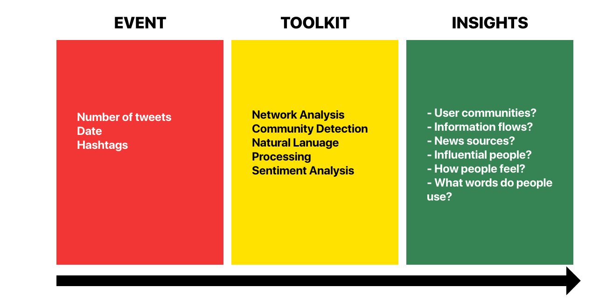

# The Project

## Idea

The main idea was inspired by [this](https://medium.com/hci-design-at-uw/information-wars-a-window-into-the-alternative-media-ecosystem-a1347f32fd8f) Medium Article where the author, [Kate Starbird](https://medium.com/@katestarbird) analyses tweets and news sources they site. With this information she manages to build a network about the flow of information.

So we thought, what can we find that is interesting about the tweets right after a big event, such a shooting, an attack (or maybe something not terrorism related)?

The main purpose of this project is to build a set of tools to which anyone
can feed a query to a database, so that he/she can directly return insights from it.
We use the data available through [twitter](https://wwww.twitter.com) to make
sense of all the opinions and facts and ~~alternative facts~~ *lies* out there. In the
process we want to try to uncover some of the hidden mechanics that bring about
our own perceived reality of these events and the constructed filter bubbles.

As the tools we developed were build with **reproducibility** in mind, we show that
we can do similar analyses quite quickly by not analysing just one event, but **two**.
In the menu on the side you can easily navigate through the different parts of
the analysis for both events easily.

In case my explanation sucks (which it probably does, here's a picture):

## Data

To handle data, we used several tools:

- [MongoDB](https://www.mongodb.com)  to store our data and [PyMongo](https://pypi.python.org/pypi/pymongo/) to handle it.
- To actually receive tweets, the GetOldTweets API that can be found [here](https://github.com/Jefferson-Henrique/GetOldTweets-python).
- [NetworkX](https://networkx.github.io) for the network analysis.
- [DeepMoji](https://github.com/bfelbo/deepmoji) for sentiment analysis and classification.
- [d3js](https://d3js.org/) for interactive plotting in Javascript.
- Other standard python libraries (numpy, matplotlib, etc.)

## Analysis

To prove the pipeline of tools, we applied them to two different events:

- The 2017 Sutherland Springs church shooting. (5th November 2017) [Notebook](https://nbviewer.jupyter.org/gist/anonymous/fc1eeb6469fb316710f448f0fca3508c)  
  *~50.000 tweets*
- The 2017 Las Vegas shooting. (1st October 2017) [Notebook]()  
  *~170.000 tweets*

There are many ways you can consult the analysis:

- Browse them in a more interactive, article-like way in the sections on the left of this page.
- Download the Notebooks, each one related to one of the events.

## Executive Summary

Throughout our analysis, we found a lot of cool stuff, here are some of the most important findings:

**<u>Las Vegas Shooting:</u>**

- [Infowars](https://www.google.dk/url?sa=t&rct=j&q=&esrc=s&source=web&cd=1&cad=rja&uact=8&ved=0ahUKEwjVmuWp1fjXAhXpd5oKHd2QB0UQFggmMAA&url=https%3A%2F%2Fwww.infowars.com%2F&usg=AOvVaw2G25vOeObieCu_h8KRtBvo) and [Intellihub](https://www.google.dk/url?sa=t&rct=j&q=&esrc=s&source=web&cd=1&cad=rja&uact=8&ved=0ahUKEwirmLyq1fjXAhUMGZoKHbS6Cw0QFggmMAA&url=https%3A%2F%2Fwww.intellihub.com%2F&usg=AOvVaw3a04njRzkJjHJ0xjcnhqkq) are within the 15 most cited sources in the database of tweets.
- The distribution of the amount of tweets with #lasvegasshooting decreases exponentially over time.
- Two communities of users were detected using the Python [Louvain \[1\]](references) Algorithm where at least 60% of the users cited  [Infowars](https://www.google.dk/url?sa=t&rct=j&q=&esrc=s&source=web&cd=1&cad=rja&uact=8&ved=0ahUKEwjVmuWp1fjXAhXpd5oKHd2QB0UQFggmMAA&url=https%3A%2F%2Fwww.infowars.com%2F&usg=AOvVaw2G25vOeObieCu_h8KRtBvo) and [Intellihub](https://www.google.dk/url?sa=t&rct=j&q=&esrc=s&source=web&cd=1&cad=rja&uact=8&ved=0ahUKEwirmLyq1fjXAhUMGZoKHbS6Cw0QFggmMAA&url=https%3A%2F%2Fwww.intellihub.com%2F&usg=AOvVaw3a04njRzkJjHJ0xjcnhqkq).

**<u>Sutherland Springs Shooting:</u>**

- On the [Sentiment Analysis](https://duarteocarmo.github.io/Project_Page_SG/sentiment-page), something very interesting happens with user sentiment at the 1 week mark, where the DeepMoji model helps us identify some sort of mourning, exactly one week after the event, where people start referring to the shooting in a more compassionate, less agressive  way.

- From [community detection](community-texas), we found a community with number 6 that was very
homogenic in its sentiment expressed in emojis towards certain hashtags,
meaning they has either only negative or only positive emojis for most hashtags.
They are big
fans of **#2a** (second amendment) but not so much of **#guncontrol**. They
display rather positive emotions for **#maga** (make america great again),
**#msm** (mainstram media, but used by far right),  **#nra** (the national rifle
association) and **#tcot** (top conservative on twitter). They seem rather
divided on **#trump** with both clapping and crying emojis. Interesting to see that
the most connected users in this community are ABC News and CBS News.
