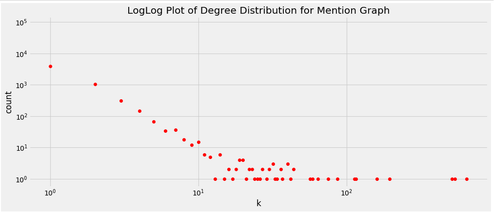
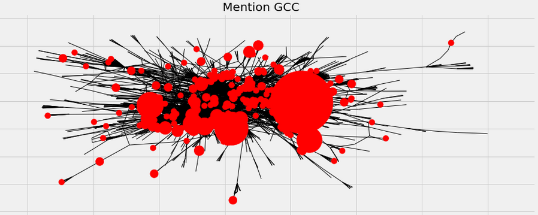
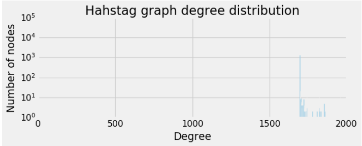
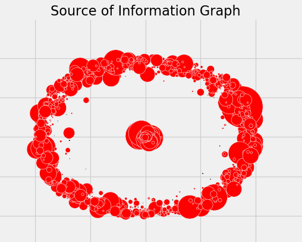
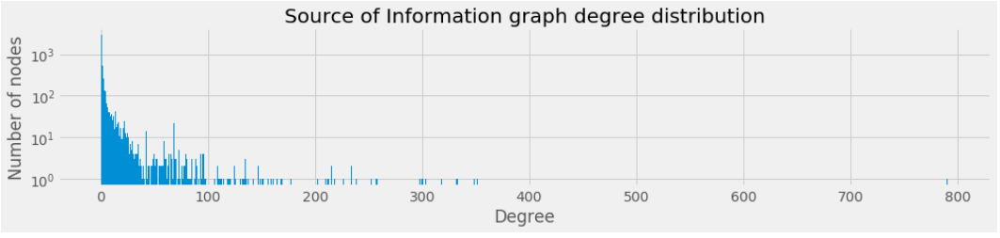
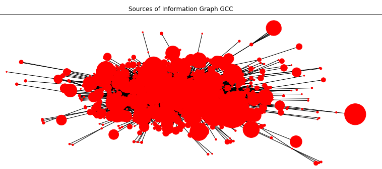

# The Networks (Las Vegas)

## Generating networks from tweets
We have very rich and interesting data to analyze. There are different networks hidden in our data. 

From the tweets we collected we are going to generate a number of different networks that we will be used throughout the analysis. 

**Network 1:**
For the first network, the *nodes* are the users who have tweeted under the hashtag '#LasVegasShooting'. The *edges* will be constructed through mentions in these tweets. So, when a tweet mentions another user that is also a *node* in the network, there will be an *edge* between these two. We will refer to this network as `mention_graph`.   

**Network 2:**
For the second network, *nodes* are still the users. We define the *edges* between *nodes* if they share a common hashtag, not including the query hashtags. For example if two tweets from different *nodes* use the hashtag **#GunSense**, we will create an *edge* between them. We will refer to this network as `hashtag_graph`. 

**Network 3:**
Finally, for the third network, *nodes* are sources of information. Those are the websites, users are referencing to.  We define the *edges* between *nodes* if same user share an article from both of the websites. For example if the user 'DonaldTrumpJr' shared articles from both 'Fox News' and 'CNN' there will be an edge between these nodes.  We will refer to this network as `info_graph`. 

Below we will start creating the networks.

All the graphs can be seen as DJ3. However since those are big graphs, it slows down the browser. You can try it by togglin the button.



## Mention Graph

### Stats

Below we have displayed some basic statistics about the mention graph.

| Number of Nodes | Number of Edges | Average Degree |
| :-------------: | :-------------: | :------------: |
|      90721      |      6209       |      0.14      |

### Degree Distribution

As we can see from the number of components in mention graph, a large part of
the networks is unconnected. This is further demonstrated by the degree
distribution of the graph. 

Also you can below see the loglog distribution.

As you can see we can safely say that the degree distribution follows  power law.  Note that there a lot of nodes without any connection. Let's see sizes of subgraphs for the mention graph. 

| Biggest Subgraph Sizes |
| :--------------------: |
|          3832          |
|           20           |
|           11           |
|           11           |
|           10           |

Here  it is wiser to look only to GCC.  This is also because when we analyzed subgraphs we have seen that GCC is much larger than the second biggest subgraph.

### Examining the GCC

Since the main graph is so disconnecte, we decide to only work with the  GCC of the graph. This allows us to perform more in depth analysis. Below you can see the GCC. 

| Number of Nodes | Number of Edges | Average Degree |
| :-------------: | :-------------: | :------------: |
|      3832       |      5078       |      2.66      |

Here the size of the nodes depend on their degrees. Obviously there are  some guys who have lots of connections. Let's see who those are. 

|  Node (User)  | Degree |
| :-----------: | :----: |
|      CNN      |  649   |
|    FoxNews    |  538   |
|  LauraLoomer  |  516   |
| TuckerCarlson |  195   |
| RealAlexJones |  160   |

Apparently people like to mention about he media in their tweets. Here we can also see that especially right wing polytical commentators (Alex Jones, TuckerCarlson) was mentioned frequently by users. This might be because the event concerns laws about gun restriction in U.S.A. 

### Hashtag Graph

Another interesting graph is hashtag graph. For this second network, *nodes* are still the users. There is an edge between two node if they had ever used same hashtag for more than a limit. Here we have chosen this limit to be 10. Thus if two users have more than 10 tweets under a hashtag there will be an edge between them.

### Stats

Below we have displayed some basic statistics about the mention graph.

| Number of Nodes(Users) | Number of Edges | Average Degree |
| :--------------------: | :-------------: | -------------- |
|         90721          |     1453345     | 32.4           |

### Degree Distribution

Let's see the degree distribution. 

This is rather an interesting distribution. Apparently nodes either do  not have any edge or they have a lot. We can thus think that there are  some arount 2000 accounts which tweets a lot on similar topics. Let's 
see the accounts with maximum degrees. 

|  Node(User)  | Degree |
| :----------: | :----: |
|  tiniskwerl  |  1967  |
| PatJohnson_9 |  1960  |
| PatJohnson_8 |  1960  |
| PatJohnson_3 |  1960  |
| PatJohnson_2 |  1960  |

From the table above we can easily say that PatJohnson accounts are bot accounts controlled from the same source. They have probably a lot of tweets with many hashtags. 

When we look at the degree distribution we see that it might be logical to analyze subgraphs, lets see sizes of biggest subgraphs. 

| Biggest Subgraph Sizes |
| :--------------------: |
|          1697          |
|           1            |
|           1            |
|           1            |
|           1            |

### Examining the GCC

Since GCC is much bigger than other components we will analyze GCC.

| Number of Nodes | Number of Edges | Average Degree |
| :-------------: | :-------------: | :------------: |
|      1697       |     1453345     |     1712.8     |

Since the graph is tightly connected (nodes have high degree), the drawing of the network is not very insightful.

## Source of Information Graph

The last graph that we think is interesting, shows the relation between sources of information. Here, the nodes are websites. There will be an  edge between two nodes if the same user cited from both sites. 
Previously we had already collected data for this part. So let's  remember some numbers and built the graph.

## Stats

In our data of 169913 tweets, there was 37077 tweets referencing a website. Of all these references , 4730 of them was different sources so in our network there will be 4730 nodes.

| Number of Nodes | Number of Edges | Average Degree |
| :-------------: | :-------------: | :------------: |
|      4730       |      15234      |      6.44      |

### Degree Distribution

The degre distribution is as follows.

Again let's check the size of the GCC in case it is meaningful we should only use it. 

| Biggest Subgraph Sizes |
| :--------------------: |
|          1602          |
|           4            |
|           3            |
|           3            |
|           3            |

So still the GCC is much bigger thus we should use GCC.

### Examining the GCC

| Number of Nodes | Number of Edges | Average Degree |
| :-------------: | :-------------: | :------------: |
|      1602       |      15088      |      18.8      |

So let's see some sites which are common citations. For this let's print nodes of high degree

|      Node(Website)       | Degree |
| :----------------------: | :----: |
|     www.youtube.com      |  791   |
|     www.nytimes.com      |  351   |
|     www.foxnews.com      |  348   |
|   www.dailymail.co.uk    |  332   |
|  www.reviewjournal.com   |  318   |
|      abcnews.go.com      |  303   |
|  www.washingtonpost.com  |  300   |
|     www.facebook.com     |  299   |
|     www.latimes.com      |  297   |
|    www.intellihub.com    |  257   |
| www.thegatewaypundit.com |  252   |
|    www.zerohedge.com     |  238   |
|        nypost.com        |  233   |
|     yournewswire.com     |  233   |
|     www.cbsnews.com      |  226   |
|       www.cnn.com        |  218   |
|      truepundit.com      |  215   |
|     www.infowars.com     |  215   |
|     www.gofundme.com     |  212   |
|     www.newsweek.com     |  211   |

Here there are some interesting insights. 

- Apparently people like to share videos about the event. Also they like to share comments on facebook. 
- There are many mainstream information sources. People share a lot of article from Fox News, CNN, DailyMail. This does however show how they reference it. When we have analzed data we have seen some examples citing an article from mainstream media to oppose it. 
- Also alternative media is common. People share lots of articles from 'intellihub.com','zerohedge.com', 'infowars.com'
- Lastly  gofundme.com is a charity site for raising money to help victims