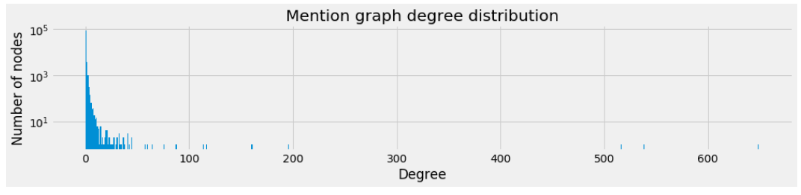

# The Networks
### #lasvegasshooting

## Generating networks from tweets
We have very rich and interesting data to analyze. There are different networks hidden in our data.

From the tweets we collected we are going to generate a number of different networks that we will be used throughout the analysis.

**Network 1:**
For the first network, the *nodes* are the users who have tweeted under the hashtag '#LasVegasShooting'. The *edges* will be constructed through mentions in these tweets. So, when a tweet mentions another user that is also a *node* in the network, there will be an *edge* between these two. We will refer to this network as `mention_graph`.   

**Network 2:**
For the second network, *nodes* are still the users. We define the *edges* between *nodes* if they share a common hashtag, not including the query hashtags. For example if two tweets from different *nodes* use the hashtag **#GunSense**, we will create an *edge* between them. We will refer to this network as `hashtag_graph`.

**Network 3:**
Finally, for the third network, *nodes* are sources of information. Those are the websites, users are referencing to.  We define the *edges* between *nodes* if same user share an article from both of the websites. For example if the user 'DonaldTrumpJr' shared articles from both 'Fox News' and 'CNN' there will be an edge between these nodes.  We will refer to this network as `info_graph`.

Below we will start creating the networks.

### Stats
Below we have displayed some basic statistics about either graph.



### Degree Distribution

As we can see from the number of components in either graph, a large part of
the networks is unconnected. This is further demonstrated by the degree
distribution of the graphs.

 

Here, as you can see graphs are rather disconnected. Thus working on the GCC is a better idea. Also note that hashtag graph is interesting since there are many elements with high degree nodes but not many with low degree is due to the way of creating the graph. There is an edge between two nodes if an only if two users shared more than 10 tweets under same hashtag.

### Plots

A javascript library called [d3js](www.d3js.org) is used to plot these graphs
in an interactive way, but it is clear that there is no good way to plot these.

You can use the buttons to inspect the different graphs and dynamically set
the node size (either uniform or logarithmically dependent on their degree).
When you hover over the nodes, you can see the *screen_name* of the user that
each node represents.



## Giant Connected Components

As the the raw networks were very large and extremely sparse, we chose to only
look at the *Giant Connected Component* (GCC) for the rest of the analysis.

### Stats

Below we have a new overview of stats from these GCC's for each graph.

  

### Plots  

This makes for much nicer plots, which can be seen below. Again with the same
controls.


