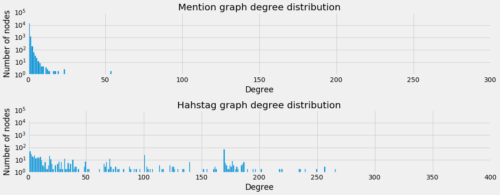
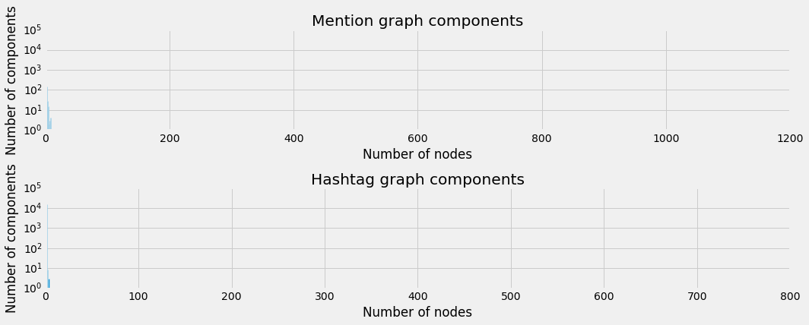
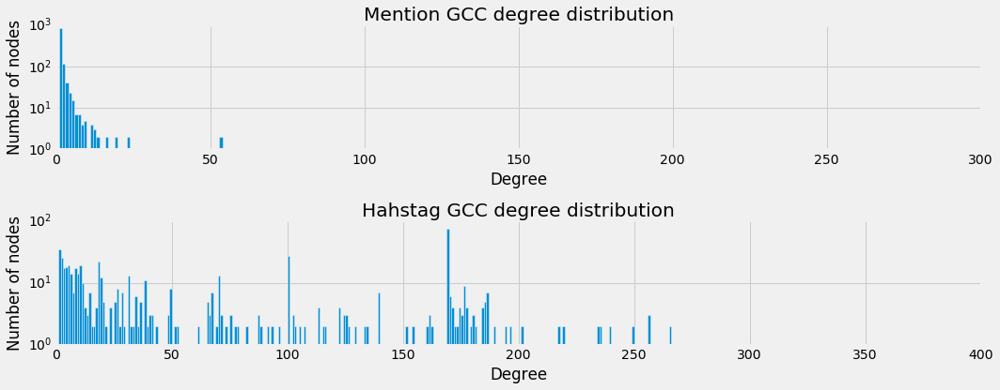

# The Networks

## Generating networks from tweets
From the tweets we collected we are going to generate 2 of different networks
that we will be using throughout the rest of the analysis. In either network,
the *nodes* are going to be the users that have been tweeting about the event
using one of the predefined hashtags.   
For the first network, the *edges* will be constructed through mentions in these
tweets. So, when a tweet mentions another user that is also a *node* in the
network, there will be an *edge* between these two *nodes*. We will refer to
this network as `mention_graph`.   
For the second network, we define the *edges* between *nodes* if they share a
common hashtag, not including the query hashtags. For example, if two tweets
from different *nodes* use the hashtag **#GunSense**, we will create an *edge*
between them. We will refer to this network as `hashtag_graph`.

### Stats
Below we have displayed some basic statistics about either graph.



### Degree Distribution

As we can see from the number of components in either graph, a large part of
the networks is unconnected. This is further demonstrated by the degree
distribution, which is shown below.

### Components

The `hashtag_graph` seems to look somewhat linear on a logarithmic scale,
suggesting that the distribution follows a power law. However, the `mention_graph`
is still not linear which indicates an even more skewed distribution. Also,
we see a large peak in either graph for nodes with a *degree* of 0. This indicates
a large amount of singletons. This becomes more clear when we look at the
distribution of the components' sizes, which is depicted below.

There are big peaks where the components sizes are very small and then almost
nothing in the end. This makes it really hard to deal with the network as is.

### Plots

A javascript library called [d3js](www.d3js.org) is used to plot these graphs
in an interactive way, but it is clear that there is no good way to plot these.

You can use the buttons to inspect the different graphs and dynamically set
the node size (either uniform or logarithmically dependent on their degree).
When you hover over the nodes, you can see the *screen_name* of the user that
each node represents.

*Please not that some graphs load slowly due to their size.*



## Giant Connected Components

As the the raw networks were very large and extremely sparse, we chose to only
look at the *Giant Connected Component* (GCC) for the rest of the analysis.

Below we have a new overview of stats from these GCC's for each graph.
### Stats


### Degree Distribution

This comes with a new degree distribution of course, which is displayed below.

### Plots

This makes for much nicer plots, which can be seen below. Again with the same
controls.


