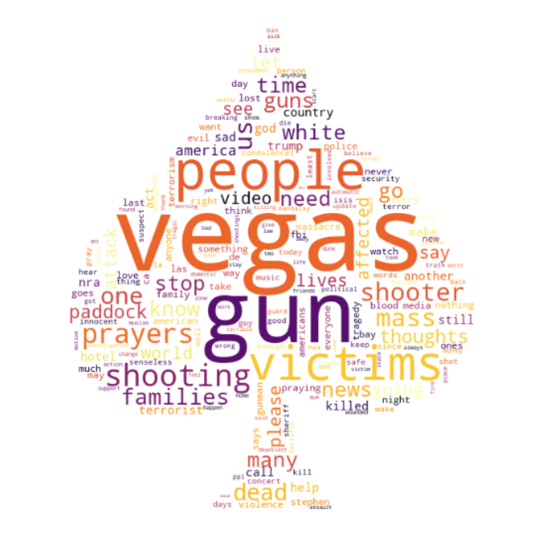
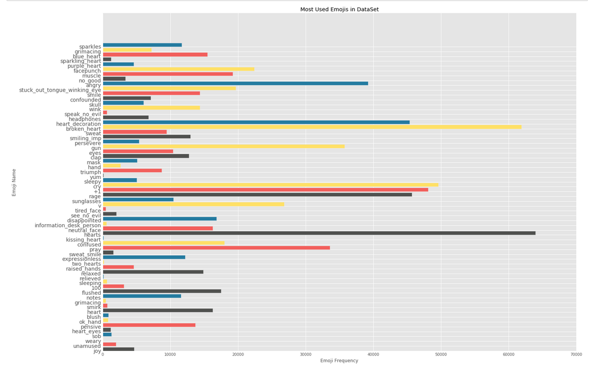
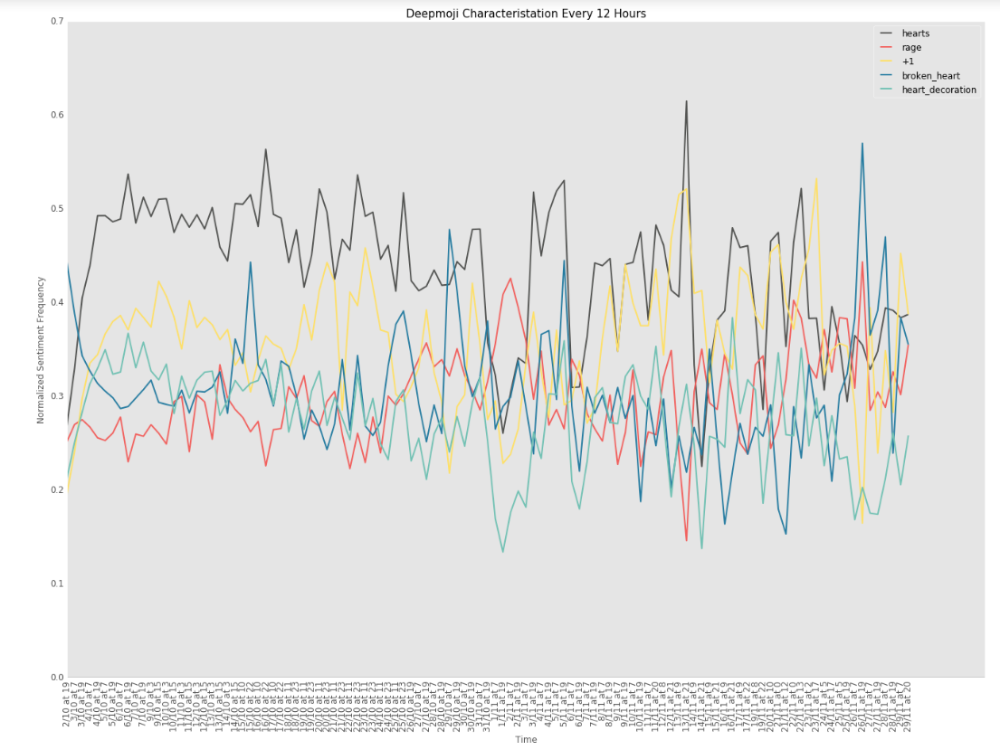

# Sentiment Analysis

## Part 1: How happy?

​	Firstly, we have studied the sentiment distribution of the Las Vegas Database in chronological order. After cleaning all of the tweets, and reducing them to their bare core, a database of happy words scoring by MIT was used. Here any hashtags or websites used within the text was removed. It's also interesting to see the change in the sentiment of "influencial" tweets. Below you can see the distribution of sentiment average hourly sentiment index and average sentiment index of the tweets with more than 100 retweets. 

LVsentiment1](./images/LVsentiment1.png)

The graph was calculated according to the following formula, let's say a period (hours in this case) has n tweets:
$$
\text{Normalized Sentiment Index}(\text{period}) = \frac{\sum^{n}_{1} \text{Happiness Score} }{n}
$$
This visualisation confirms the hypothesis that popular tweets are  **more emotional**. Also we can safely say that there is a correlation between the hourly average sentiment of popular tweets and the overall average hourly sentiment.

Another interesting fact is to see the "week" mark (when 150 hours go by) and to see how the overall sentiment is one of **mourning**.

## Part 2 : 	What about words?

The second part of the sentiment analysis was all about words. When sitting in a big database of tweets, it's interesting to look at the vocabulary and see what it tells about a given situation.

To do this, a handy python library called **wordCloud**, with it, a wordcloud visualisation was possible. As you can see, there are a lot of words here that make sense, given the tweets that were extracted. On another hand, there are some unexpected ones, namely "Trump". However, this image is really helpful in understanding the semantics around this event.

But this is limited. It seems that a simple word analysis does not tell as much, what exactly are people feeling?

## Part 3: How can emojis refine sentiment?💡

DeepMoji is a model trained on 1.2 billion tweets with emojis to understand how language is used to express emotions, you can learn more about it [here](https://github.com/bfelbo/DeepMoji). Using this model, we were able to go further than simply what words people use, but how people are actually feeling.

For each tweet, we used the DeepMoji pre-trained model to characterise the tweets. Using this technique, we could extract the emojis/emotions that best characterise the tweets. This model gives 5 emojis which best suits to the sentiment of the given tweet. Below you can see the frequency of emojis. 

| Emoji | Frequency(%) |
| :---: | :----------: |
|   ♥   |    37.66     |
|  💔   |    36.43     |
|  😢   |    29.21     |
|  👍   |    28.31     |
|  😡   |     26.9     |
|  💟   |    26.69     |
|  😠   |    23.08     |
|  🔫   |    21.04     |
|  🙏   |    19.78     |
|   ✌   |    15.79     |
|  👊   |     13.2     |
|  😜   |    11.58     |
|  💪   |    11.32     |
|  😕   |    10.58     |
|  😳   |     10.3     |
|  😞   |     9.91     |
|   ❤   |     9.58     |
|  😐   |     9.56     |
|  💙   |     9.12     |
|   ☺   |     8.76     |

This showed us that most people were feeling compassion (❤️), but also some anger(🔫), and mourning (💔+🙏🏻). Of course, it is hard to know exactly how a certain person feels based on emojis, but it can certainly give a better insight than only Part 1.

But not only the top 20 are interesting, if we take a look at all of the emojis and their use, we can comprehend even more, let's take a look:

It's quite apparent that certain emotions are "dominating" others, for example, 🔫  occurs 35748 times - that's almost 2 times of 💪 (!). One possible way of interpreting this, is that for every 1 person that is felling 💪, 2 are feeling 🔫.  Well, the data was collected right after a shooting, so it makes sense.

Since we analysed how the happiness index evolves over time, we thought it would be interesting to see how the sentiment evolves over time. (every 12 hours in this case.)

This figure describes the tweets with emojis over time using the DeepMoji model. Severall things are interesting and worth descibing in this graph, let's mention some of them: 

- At the beginning of the event, there is a great rise in tweets characterized with the **heart** emoji. At this point, the use of **broken heart** goes down dramatically. 
- Also interesting is the fact that over almost all 12-hour periods, the **hearts** emoji is the most frequent in characterizing tweets. 