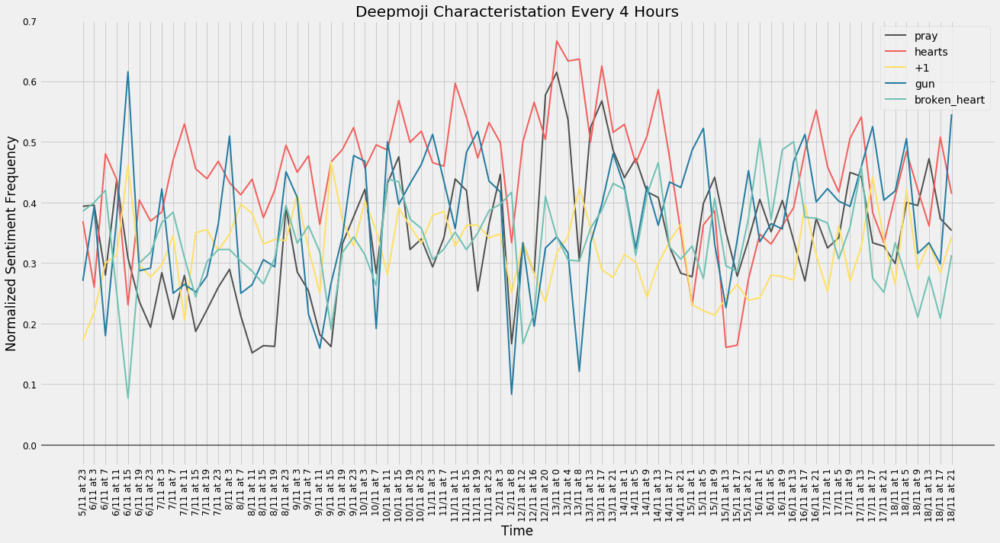

---
layout: sentiment
---

# Sentiment Analysis

## Part 1: How happy?  

​	The first aim was too study the sentiment of all of the tweets in our database, over time. After cleaning all of the tweets, and reducing them to their bare core, a database of happy words scoring by MIT was used. It's also interesting to see the "influencial" tweets and if they are connected to the popular opinion at all.

This visualisation confirms the hypothesis that popular tweets are not only **more emotional**, but also seem to module the popular opinions by some degree.

Another interesting fact is to see the "week" mark (when 150 hours go by) and to see how the overall sentiment is one of **mourning**.

But this analysis is not perfect, for example, this Normalised Sentiment Index only takes into account the happy words, and gives a happiness score. Furthermore, the python library used to extract tweets, seems to deliver them in a sort of random way, therefore, it can be hard to get a lot of "popular tweets".

This was calculated according to the following formula, let's say a period (hours in this case) has n tweets:
$$
\text{Normalized Sentiment Index}(\text{period}) = \frac{\sum^{n}_{1} \text{Happiness Score} }{n}
$$

## Part 2: What about words?  

​	The second part of the sentiment analysis was all about words. When sitting in a big database of tweets, it's interesting to look at the vocabulary and see what it tells about a given situation.

To do this, a handy python library called **wordCloud**, with it, a wordcloud visualisation was possible. As you can see, there are a lot of words here that make sense, given the tweets that were extracted. On another hand, there are some unexpected ones, namely "Trump". However, this image is really helpful in understanding the semantics around this event.

But this is limited. It seems that a simple word analysis does not tell as much, what exactly are people feeling?

## Part 3: How can emojis refine sentiment?💡

​	DeepMoji is a model trained on 1.2 billion tweets with emojis to understand how language is used to express emotions, you can learn more about it [here](https://github.com/bfelbo/DeepMoji). Using this model, we were able to go further than simply what words people use, but how people are actually feeling.

For each tweet, we used the DeepMoji pre-trained model to characterise the tweets. Using this technique, we could extract the emojis/emotions that best characterise the tweets.

This showed us that most people were feeling compassion (❤️), but also some anger(🔫), and mourning (💔+🙏🏻). Of course, it is hard to know exactly how a certain person feels based on emojis, but it can certainly give a better insight than only Part 1.

| Emoji | Frequency |
| :---: | :-------: |
|  ❤️*  |   17093   |
|  🔫   |   16037   |
|  💔   |   14085   |
|  🙏   |   13855   |
|  👍   |   12353   |
|  💟   |   12049   |
|  😢   |   12015   |
|  😡   |   11016   |
|  😠   |   8095    |
|  😐   |   5371    |
|  😕   |   4528    |
|  ✌🏻  |   4367    |
|  😳   |   4258    |
|  ❤️   |   4069    |
|  😞   |   3591    |
|  😈   |   3469    |
|  😑   |   3354    |
|  💪   |   3152    |
|  👊   |   3115    |
|   ✨   |   2952    |

 (**)The first emoji that is more frequent is actually [hearts](https://emojipedia-us.s3.amazonaws.com/thumbs/144/twitter/103/black-heart-suit_2665.png) but this emoji does not exist in OSX, and therefore, I had to use a different one for aesthetic purposes.*

But not only the top 20 are interesting, if we take a look at all of the emojis and their use, we can comprehend even more, let's take a look:

It's quite apparent that certain emotions are "dominating" others, for example, ✌🏻 occurs 4300 times, and 🔫  occurs 16000 times - that's almost 4 times more (!). One possible way of interpreting this, is that for every 1 person that is felling ✌🏻, 4 are feeling 🔫.  Well, the data was collected right after a shooting, so it makes sense.

Since we analysed how the happiness index evolves over time, we thought it would be interesting to see how the sentiment evolves over time. (every 3 hours in this case.)

By plotting the normalised sentiment frequency, we can see the evolution of certain emojis/sentiments. This allowed to realise several things:

1. The first sentiment to have high frequency and use is the 🔫, which starts by peaking at 0,6. After that, it fluctuates going to a very low point around the 12th of November.
2. When the sentiment is 🔫, the sentiment 💔 actually drops! This could indicate that were are in the presence of actual rage and not just tweets using the word gun.
3. Only at the week mark, around the 13th of November, the use of ❤️ and 🙏🏻 starts to rise, peaking at very interesting levels, and in a correlated fashion. This rise corresponds to the big drop in happiness in the first graph of the first part, which could mean that this is mourning/faith, rather than love.

Figures were too small? Browse them [here](https://imgur.com/a/FWdZy) for a "bigger picture".
